# bkn-dsh -9 图文使用手册

[English](README.en.md) · [HTML](guide.zh.html) · [PDF](bkn-dsh-9-user-guide.zh.pdf)

DSH 0.2.0-rc.2 · Plugin 0.2.0-rc.2-openbkn.0.2.0-9 · 2026-10-11

安装 · 登录 · 供应链问答 · 溯源 · 诊断

截图来自中文界面；红色数字与图下说明对应。账号名、平台地址、本机路径和执行标识的展示已替换为示例，不改变操作控件或业务结果。

## 目录

- [先认识这三个入口](#start)
- [01 · 安装并确认插件](#install)
- [02 · 填写平台地址](#config)
- [03 · 确认 OpenBKN CLI 可用](#cli)
- [04 · 登录 OpenBKN](#login)
- [05 · 选择知识网络，建立专用工作区](#network)
- [06 · 发送业务问题，读懂回答](#ask)
- [07 · 执行溯源：这一轮做了什么](#execution)
- [08 · 业务上下文图：回答用到了哪些业务元素](#graph)
- [09 · 证据链：找到平台回执](#evidence)
- [10 · 继续追问，或开始新的问题](#continue)
- [11 · 诊断与导出：把问题说明白](#diagnostics)
- [12 · 常见问题速查](#faq)
- [附录 · 本手册验证范围](#scope)

<a id="start"></a>

## 先认识这三个入口

bkn-dsh 把 OpenBKN 业务知识网络接进 DSH。你在 DSH 里用自然语言提问，插件负责连接、限定知识网络和记录业务访问；业务数据与计算由 OpenBKN 提供，答案由模型组织。

1. 插件：安装、启用、确认版本。
2. OpenBKN：配置平台、登录、选择知识网络、查看诊断。
3. 会话：保持标准模式，发送业务问题，完成后查看业务溯源。

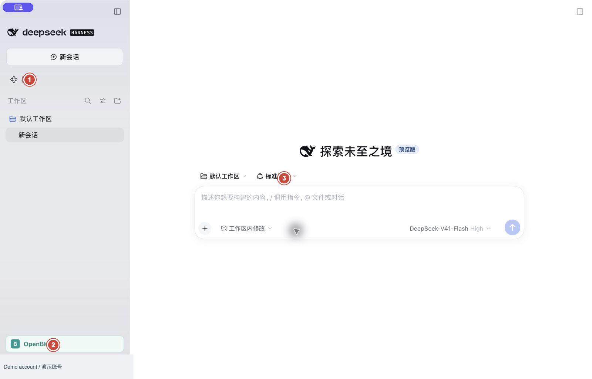

*DSH 桌面主界面；红色编号表示需要关注或点击的位置。*

**1** 插件入口 · **2** OpenBKN 入口 · **3** 标准模式

<a id="install"></a>

## 01 · 安装并确认插件

先安装并登录 DSH 桌面版。本手册适用于 DSH 0.2.0-rc.2 和插件 0.2.0-rc.2-openbkn.0.2.0-9；截图来自 macOS 官方桌面版的隔离环境。

1. 点击左侧“插件”，再点击右上角“添加插件”。
2. 在“包名或地址”中填写固定版本 `@openbkn/dsh-business-context@0.2.0-rc.2-openbkn.0.2.0-9`，也可以填写从官方 Release 下载的 .tgz 的绝对路径。
3. 选择可访问的安装源，点击“安装”；若已经安装，直接检查其开关是否启用。
4. 点击已安装的 @openbkn/dsh-business-context，确认版本以 -9 结尾，三个组件显示运行中。

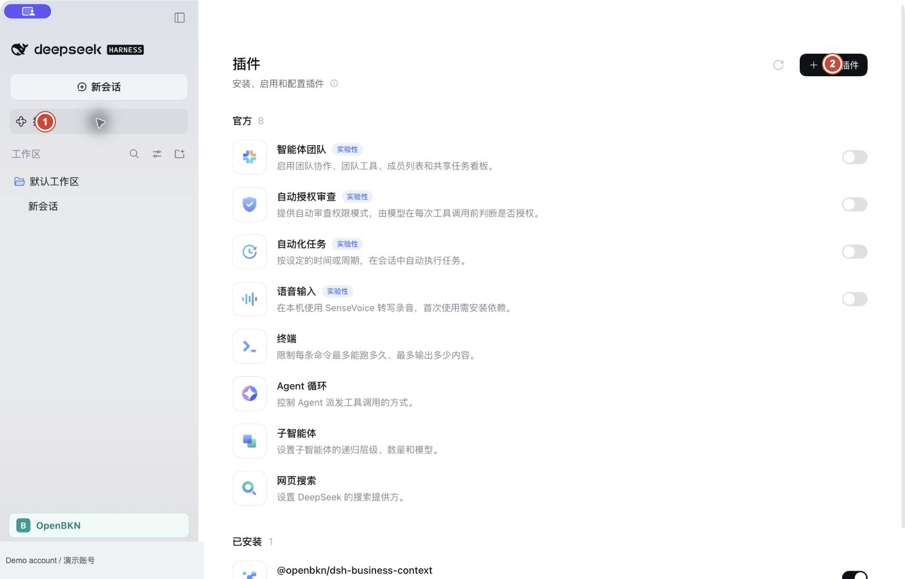

*插件管理页：先添加插件，安装后在下方检查已安装条目。*

**1** 进入插件 · **2** 添加插件

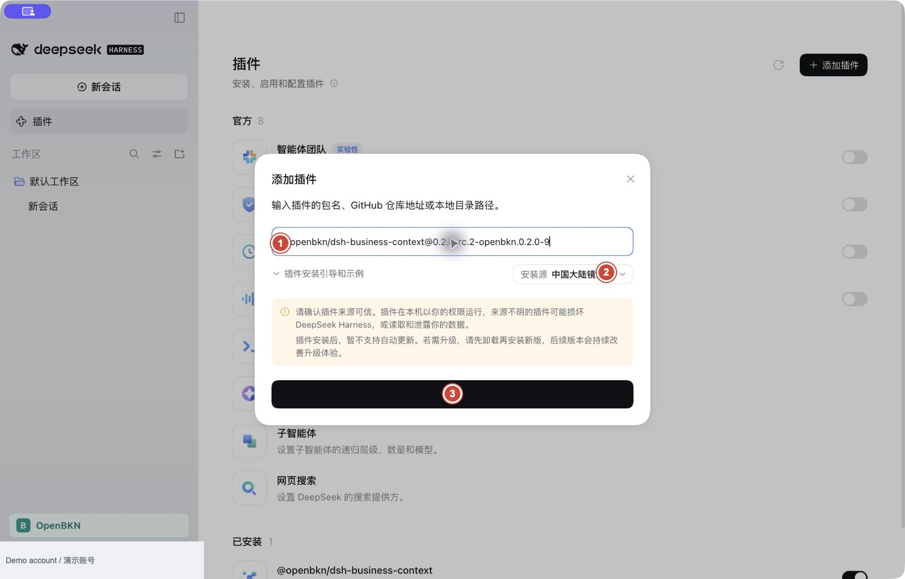

*安装填写示意：只展示填写位置，本次未重复安装。*

**1** 填写包名或 tgz 绝对路径 · **2** 选择安装源 · **3** 点击安装

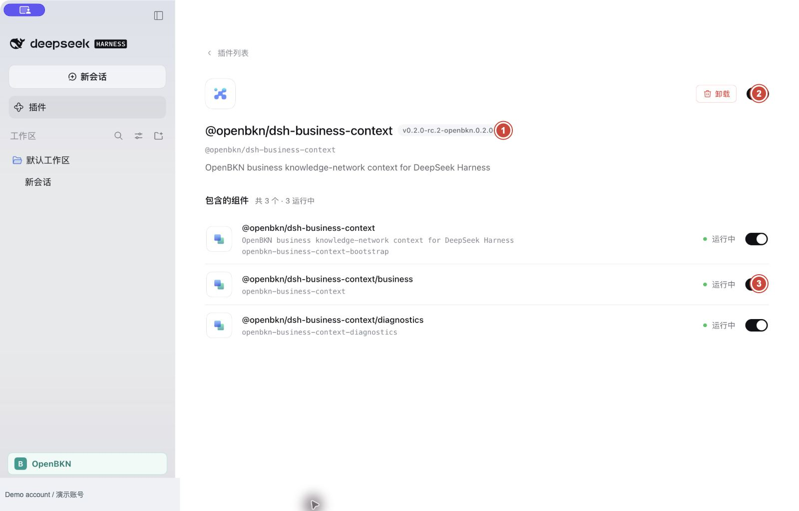

*当前实际加载的插件版本与组件状态。*

**1** 确认版本以 -9 结尾 · **2** 整包已启用 · **3** 组件运行状态

> -9 已正式发布。请从 [官方 Release](https://github.com/openbkn-ai/bkn-dsh/releases/tag/v0.2.0-rc.2-openbkn.0.2.0-9) 获取固定版本安装包。截图的安装表单仅演示填写位置，采集时未重复安装。普通用户无需构建源码或安装旧 Runtime 归档。

<a id="config"></a>

## 02 · 填写平台地址

向管理员确认完整的平台地址。远程平台请使用 https://；http:// 仅适合本机回环地址。本次演示平台为 https://openbkn.example.com。

1. 点击左下角“OpenBKN”，再点击面板右上角“设置”。
2. 把平台地址填入“OpenBKN 平台地址”，不要只填裸 IP。
3. 点击“保存并继续”。看到“设置已保存”仅表示配置生效；接下来还需要登录。

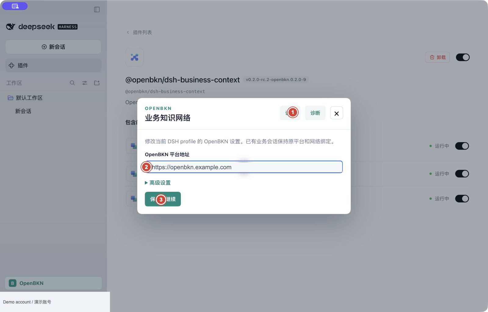

*平台配置表单。*

**1** 设置入口 · **2** 填写 HTTPS 平台地址 · **3** 保存并继续

> 本次平台使用开发证书，隔离 DSH 启动时通过 NODE_EXTRA_CA_CERTS 读取管理员已提供的证书，仍执行 TLS 校验。普通用户应由管理员准备证书环境。已有会话保留原平台和知识网络绑定；修改平台地址不会把旧会话自动改绑到新平台。业务回合执行中请等它结束再改设置。

<a id="cli"></a>

## 03 · 确认 OpenBKN CLI 可用

CLI 是插件完成 OpenBKN 登录所需的本机程序。-9 提供检测和显式安装入口。

1. 在“设置”中展开“高级设置”。
2. 如果显示“CLI 0.1.5 可用”，可继续；本次隔离环境已安装，无需重复安装。
3. 如果找不到 CLI，点击“检测并安装 CLI”。程序先找已有 CLI，仅符合条件且确实缺失时通过本机 npm 安装固定 0.1.5。
4. 等待出现可用状态；自动发现的路径会填入表单，若提示尚未保存，再点击“保存并继续”。
5. 已有 CLI 但找不到时填写可执行文件的绝对路径；Windows 要写到 openbkn.cmd，不能只填写目录。

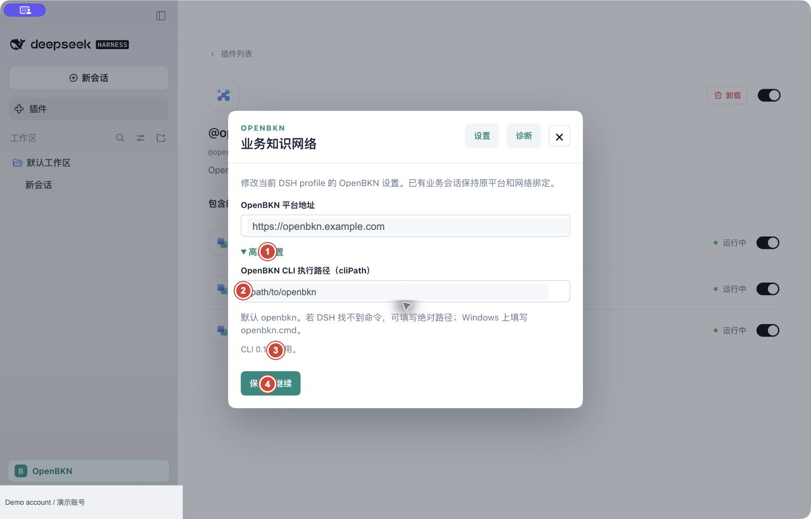

*高级设置：本次实际检测到 CLI 0.1.5 可用。*

**1** 展开高级设置 · **2** CLI 可执行文件路径 · **3** 实际可用状态 · **4** 保存并继续

> 自动安装需要可用的 Node/npm 和可写的 npm 全局目录。支持 Node 22.19+ 的 22 系列或 24+；Node 23 不支持。自动安装固定 SDK 0.1.5，适用于 0.1.5 平台。失败时按照提示处理网络、证书或权限问题；关闭面板不会取消已开始的安装，可重新进入高级设置查看进度。

<a id="login"></a>

## 04 · 登录 OpenBKN

DSH 登录与 OpenBKN 登录是两个步骤。前者让你使用模型，后者决定你能访问哪些业务知识网络。

1. 在 OpenBKN 面板点击“使用 OpenBKN CLI 登录并同步”。
2. 在自动打开的浏览器里完成平台登录和正常授权；密码只在平台登录页输入。
3. 返回 DSH，等待出现业务知识网络列表；必要时点击“刷新状态”。

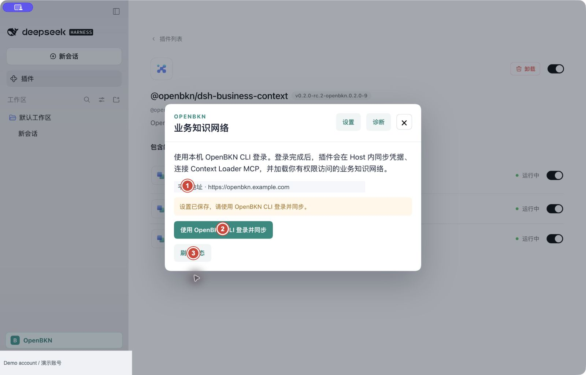

*从 DSH 发起 OpenBKN 登录。*

**1** 先核对平台地址 · **2** 发起浏览器登录 · **3** 返回后刷新状态

> 无需把 Token 粘贴到 YAML、会话或手册里。重新登录可以处理认证过期，但不能保证解决权限不足；无权限需要管理员授权。

<a id="network"></a>

## 05 · 选择知识网络，建立专用工作区

知识网络决定这段会话可以访问的业务范围。本次选择供应链样例，而不是在空白会话里仅提到“供应链”。

1. 在 OpenBKN 面板中按名称、ID 或说明搜索“供应链”。
2. 点击网络的“查看”，核对名称、ID 和业务说明。本次 ID 为 `supply_ontology_hand`。
3. 尚未关联时点击“新建工作区”，在系统目录选择器中选择专用目录。本次使用 `/path/to/supply-workspace`。
4. 进入新会话后，在发送第一条消息前确认“标准模式”。推荐问题可以帮助入门，点击后先检查输入框，再发送。

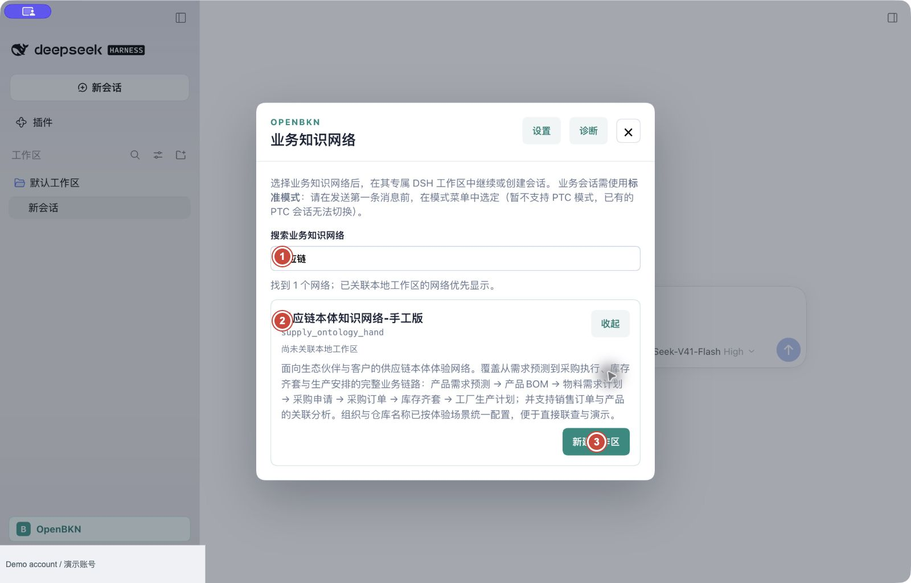

*先查看供应链网络详情，再创建专用工作区。*

**1** 搜索网络 · **2** 核对网络名称与 ID · **3** 新建工作区

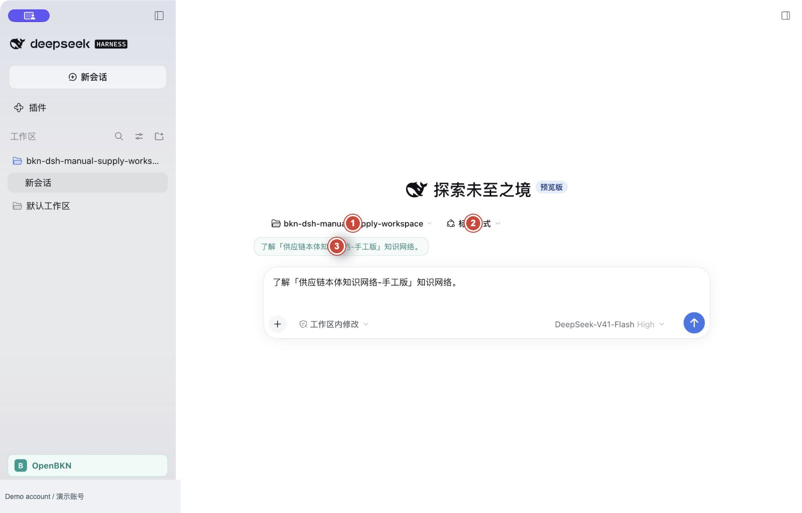

*绑定后的新会话：工作区、标准模式与推荐问题。*

**1** 专用工作区 · **2** 标准模式 · **3** 推荐问题

> 本版本业务会话暂不支持 PTC。已经发送消息的 PTC 会话无法直接切换，请从已绑定工作区新建标准会话。工作区是本机目录，知识网络仍来自平台。

<a id="ask"></a>

## 06 · 发送业务问题，读懂回答

先从对象、字段和关系入手，确认模型真的访问了当前知识网络，再逐步追问具体业务。

1. 在输入框填写问题。可以直接使用本次实机问题：

```text
请基于当前供应链知识网络，说明采购订单包含哪些关键字段，以及它与供应商、物料之间的关系。请先查询网络再回答，用普通业务用户能看懂的中文说明。
```

2. 确认标准模式，点击右下角向上箭头发送，等待模型完成。
3. 阅读回答时核对对象、字段、关系方向和数据范围。必要时要求提供查询依据，说明样本数量与统计口径。
4. 滚到回答末尾，检查限制说明，再点击“查看业务溯源”。

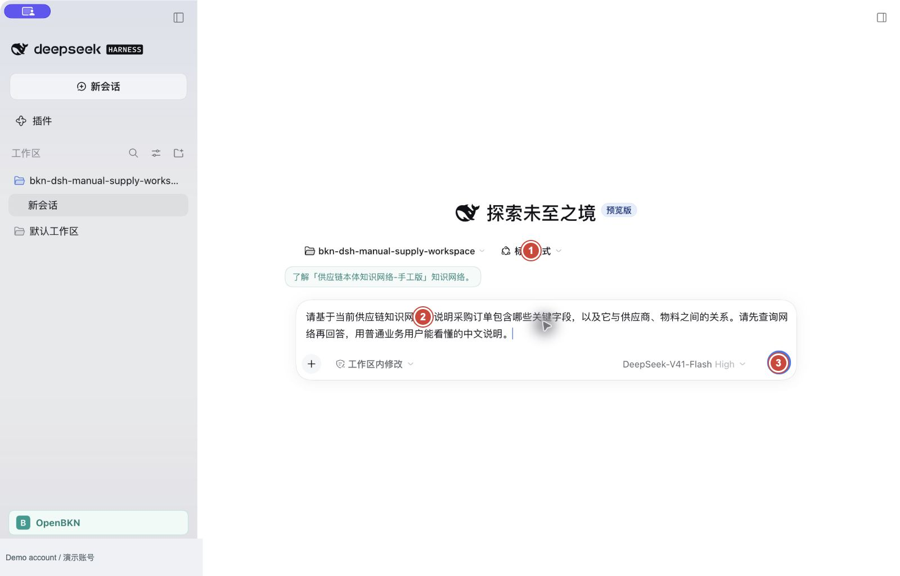

*本次实际发送的业务问题。*

**1** 确认标准模式 · **2** 填写业务问题 · **3** 发送

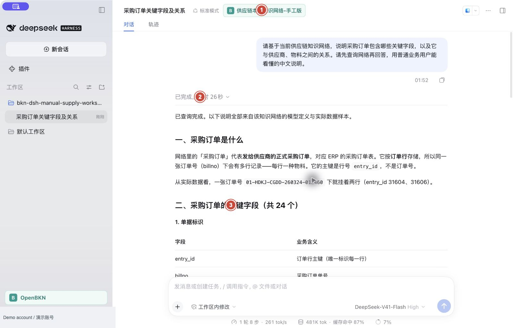

*实机回答：采购订单的字段与业务含义。*

**1** 会话绑定的知识网络 · **2** 本轮已完成 · **3** 阅读业务字段说明

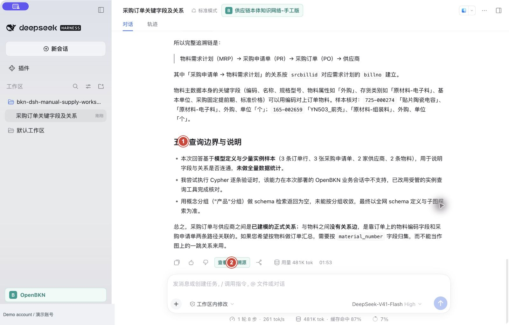

*答案末尾的边界说明和溯源入口。*

**1** 先读数据与能力限制 · **2** 查看业务溯源

> 本次问答实际完成，耗时 26 秒，模型使用网络定义和少量实例解释采购订单。一次 run_cypher 调用被插件拒绝后改用受管实例查询成功。样本包含 3 条订单行、3 条采购申请、2 条供应商和 2 条物料，不能视为全量统计；“已完成”也不是业务结论已由人工验收。

<a id="execution"></a>

## 07 · 执行溯源：这一轮做了什么

打开“查看业务溯源”后，先看“执行溯源”。这里把本机执行过程与平台返回的执行事实分开展示。

1. 点击“执行溯源”，核对 Interaction 标识和 completed 等终态。
2. 向下滚动时间链，查看调用顺序、成功或失败以及模型如何继续处理。
3. 继续下滚到平台执行事实，查看每个 Operation 的请求、Trace 与 Receipt 引用。
4. 遇到失败时判断它发生在本地执行还是平台访问，不要仅根据最终完成状态忽略中间失败。

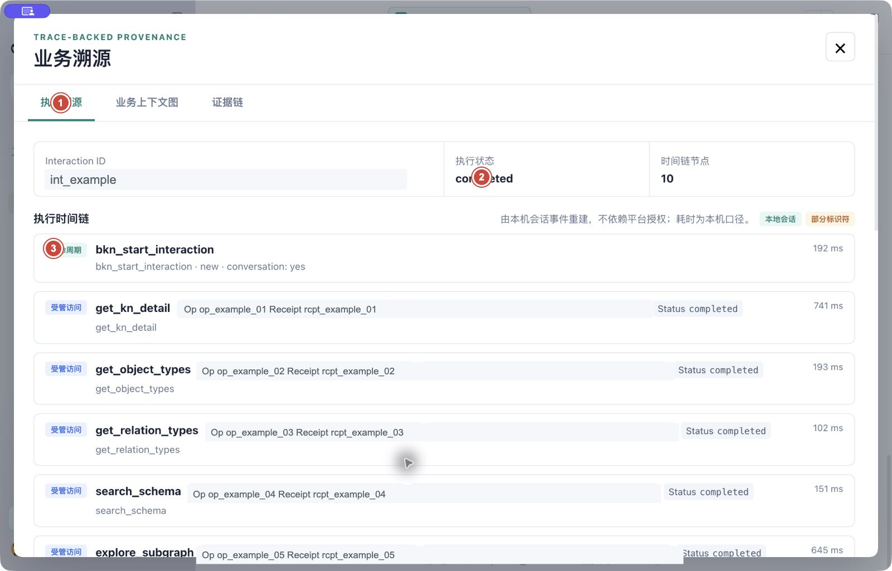

*本轮执行时间链；上下滚动查看全部节点。*

**1** 执行溯源标签 · **2** 本轮终态 · **3** 逐项查看时间链

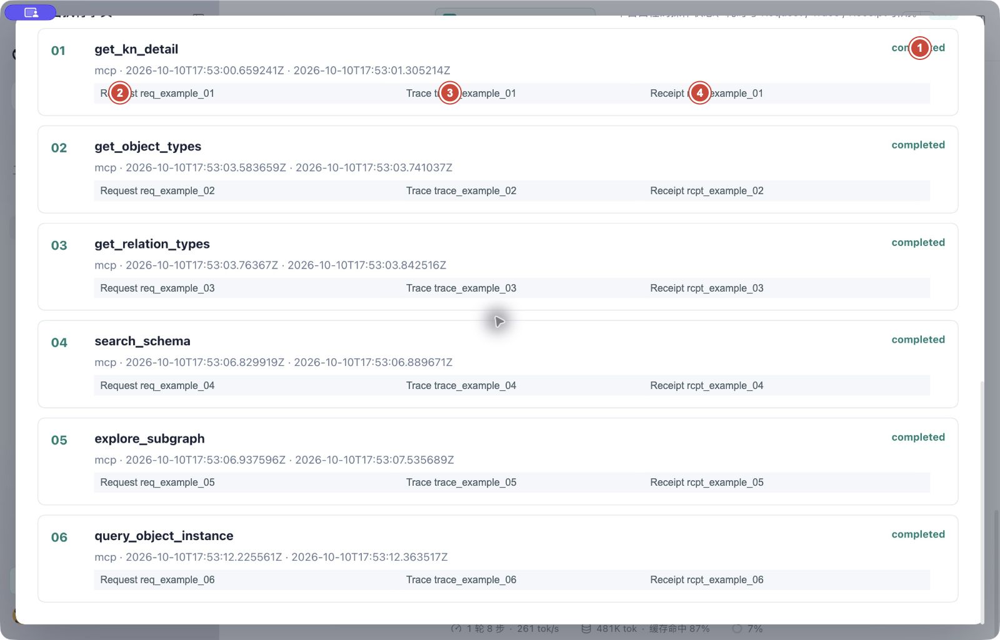

*向下滚动后出现平台执行事实。*

**1** 操作状态 · **2** 请求引用 · **3** Trace 引用 · **4** Receipt 引用

> 本次记录了 10 个本地时间链节点与 6 个平台操作。Interaction 用于把业务访问关联到当前回答；Operation、Trace 和 Receipt 是进一步定位的引用，彼此用途不同。

<a id="graph"></a>

## 08 · 业务上下文图：回答用到了哪些业务元素

点击“业务上下文图”，查看平台为本轮回答披露的业务元素。它帮助你理解答案依据涉及哪些对象和关系类型。

1. 切换到“业务上下文图”。
2. 点击“采购订单”等元素，查看右侧详情。
3. 核对知识网络、来源 Operation 和解析工具，确认元素与本轮访问的关联。
4. 结合回答阅读图，不要根据没有连线就推断整个网络没有业务关系。

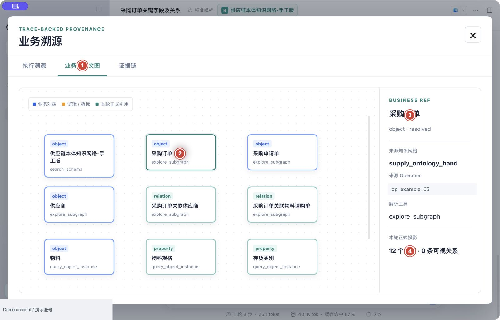

*点击采购订单元素，右侧查看来源与披露范围。*

**1** 业务上下文图标签 · **2** 点击采购订单元素 · **3** 阅读元素详情 · **4** 查看投影范围说明

> 本次面板有 12 个正式引用元素、0 条可视关系。这是平台对本轮上下文的披露投影，不是整个知识网络的完整关系图。关系类型元素与图中连接线也不是同一件事。

<a id="evidence"></a>

## 09 · 证据链：找到平台回执

点击“证据链”，把答案相关操作对应到平台回执，便于需要进一步核对时定位。

1. 切换到“证据链”，检查回执来源和状态。
2. 记录或复制需要核对的 Receipt 标识。
3. 需要独立核验时，将该标识交给管理员，或在已正确配置的平台 CLI 环境按面板给出的命令查询。
4. 没有回执、未披露或无权限时按面板提示处理，不能自动推断执行失败或数据不存在。

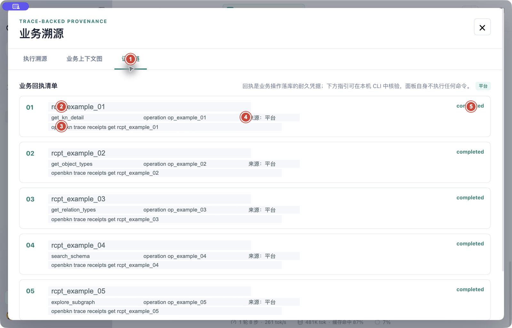

*本轮 6 个平台回执及进一步查询指引。*

**1** 证据链标签 · **2** 回执标识 · **3** CLI 查询指引 · **4** 核对来源 · **5** 核对状态

> 面板展示回执引用，不会自动执行 openbkn trace receipts get 命令。本次已打开回执面板，但未逐条做独立 CLI 回执核验；completed 不等于答案正确性证明。

<a id="continue"></a>

## 10 · 继续追问，或开始新的问题

同一业务主题可以继续原会话；新主题可以新建会话，保持已绑定的供应链工作区。

1. 点击左下角 OpenBKN，展开已关联的供应链网络。
2. 点击“继续会话”返回已有会话；点击“新建会话”开始新问题。
3. 追问时明确对象、条件、时间和需要的结果，例如：“采购订单与供应商通过哪个字段关联？请给出已建模关系的依据。”
4. 数量、金额等统计问题请明确去重方式、订单头与订单行、日期范围；如果平台缺少相应能力或数据，请让模型明确说明。

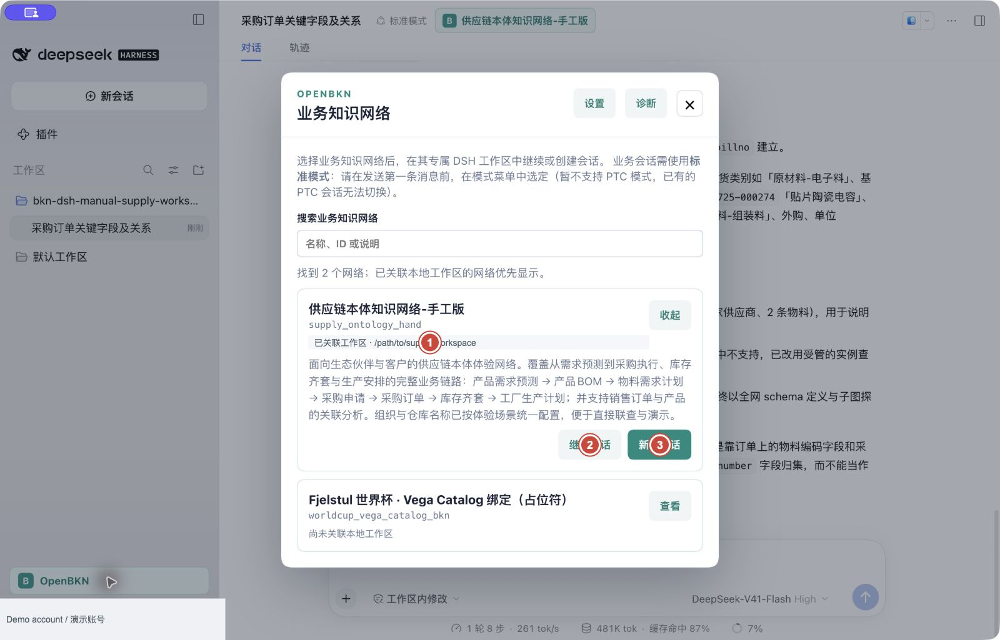

*已关联工作区的网络提供继续与新建入口。*

**1** 确认已关联工作区 · **2** 继续会话 · **3** 新建会话

> 切换知识网络请回到 OpenBKN 面板，进入该网络的专用工作区并创建会话。仅在问题中写“换一个网络”不会可靠地改变会话绑定。

<a id="diagnostics"></a>

## 11 · 诊断与导出：把问题说明白

出现连接、登录、网络列表或溯源异常时，从 OpenBKN 面板右上角“诊断”进入。

1. 打开诊断，先看报告编号、采集时间与版本。
2. 逐项查看通过、失败、未知等结果，结合当前报错定位 CLI、认证、网络列表或平台溯源。
3. 修复后点击“重新采集”查看最新记录。该动作整理已有观察，并非重新执行一次全链业务测试。
4. 点击“导出诊断报告”，在系统保存窗口选择目录与文件名。向管理员反馈时一起提供出现问题的步骤、时间、报错及报告。

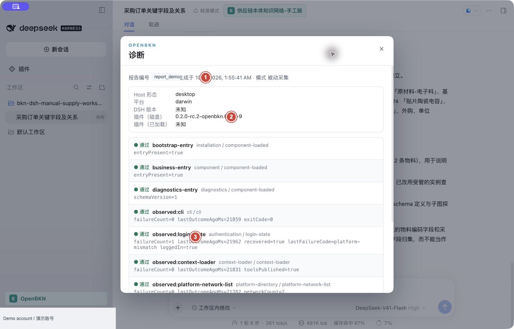

*诊断顶部：报告信息、磁盘版本及观察结果。*

**1** 报告编号与采集时间 · **2** 磁盘插件版本 · **3** 登录历史与恢复状态

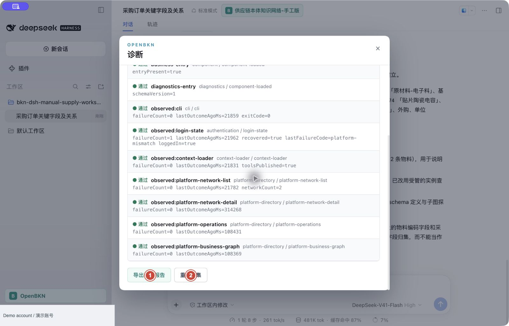

*滚到诊断底部，导出 JSON 报告或重新采集。*

**1** 导出诊断报告 · **2** 重新采集

> 本次导出报告的 10 个检查项均通过。诊断模式是“被动采集”；登录记录中 failureCount=1 同时 recovered=true，表示先前失败已经恢复。DSH 版本与插件已加载版本显示“未知”是采集信息不足；本次另外通过应用版本和插件详情确认了版本，不能把“未知”改写成已验证。

<a id="faq"></a>

## 12 · 常见问题速查

| 遇到的情况 | 下一步 |
| --- | --- |
| 没有 OpenBKN 入口 | 进入插件管理，确认包已安装、开关启用、组件运行；仍缺失时按 DSH 提示重启并导出诊断。 |
| CLI 找不到或安装失败 | 展开高级设置检测；已有 CLI 填写可执行文件绝对路径。检查 Node/npm、网络、证书和目录权限。 |
| 登录后仍无网络 / platform-mismatch | 核对 HTTPS、端口与当前平台；保存后重新登录并刷新。确认账号已获网络权限。 |
| 证书错误 | 让管理员配置平台可信证书或企业 CA。开发证书环境需按管理员提供的方法启动 DSH。 |
| 已有 PTC 会话无法切换 | 从知识网络绑定工作区新建会话，在首条消息前选择标准模式。 |
| 回答没有查到数据 | 核对网络徽标、对象名、过滤条件和权限；要求模型解释空结果与查询范围。 |
| 平台能力不支持 | 保留错误和溯源，按已有受管能力继续；不能要求模型用本地猜测代替平台统计。 |
| 溯源未就绪 / 未结束 | 等待当前回合结束后再查看。没有 finish 或中途取消时，终态与完整性可能不同。 |
| 溯源无权限 / 未披露 / 平台不可用 | 三者原因不同，按面板具体状态处理；权限交管理员，连接检查平台地址和服务。 |
| 业务图没有连线 / 没有回执 | 只代表本轮可展示内容有限；结合执行事实判断，不当作整个网络无关系或无数据。 |
| 诊断显示未知或历史失败 | 查看采集时间及 recovered 状态；未知是没有采集到证据，重新采集不等于主动测试。 |

1. 首次成功的检查顺序：插件运行 → CLI 可用 → 平台地址正确 → 登录成功 → 网络已绑定 → 标准模式 → 实际提问 → 查看溯源。
2. 反馈问题时提供步骤、时间、错误信息和诊断报告；登录密码与 Token 不需要发到会话里。

<a id="scope"></a>

## 附录 · 本手册验证范围

本手册基于 2026-10-11 的 macOS 官方 DSH 隔离环境实机流程编写。示例网络为 supply_ontology_hand，地址和工作区请替换为自己的环境。

1. 已实际完成：确认安装版本、CLI 检测、HTTPS 平台登录、供应链网络选择、目录绑定、真实业务问答、三个溯源标签和诊断导出。
2. 安装填写页面用于说明操作位置；本次未重复安装插件与 CLI。Windows 界面、全量业务统计与每条回执的独立 CLI 核验未在本次手册采集中验证。
3. 平台：https://openbkn.example.com；知识网络：供应链本体知识网络-手工版 / supply_ontology_hand。
4. 图中的回答属于本次模型输出；正式业务结论仍需核对字段、过滤条件、样本范围与平台返回结果。
5. GitHub 中可直接阅读 Markdown，点击图片查看大图；下载 HTML 后可离线阅读、放大截图并打印 PDF。
